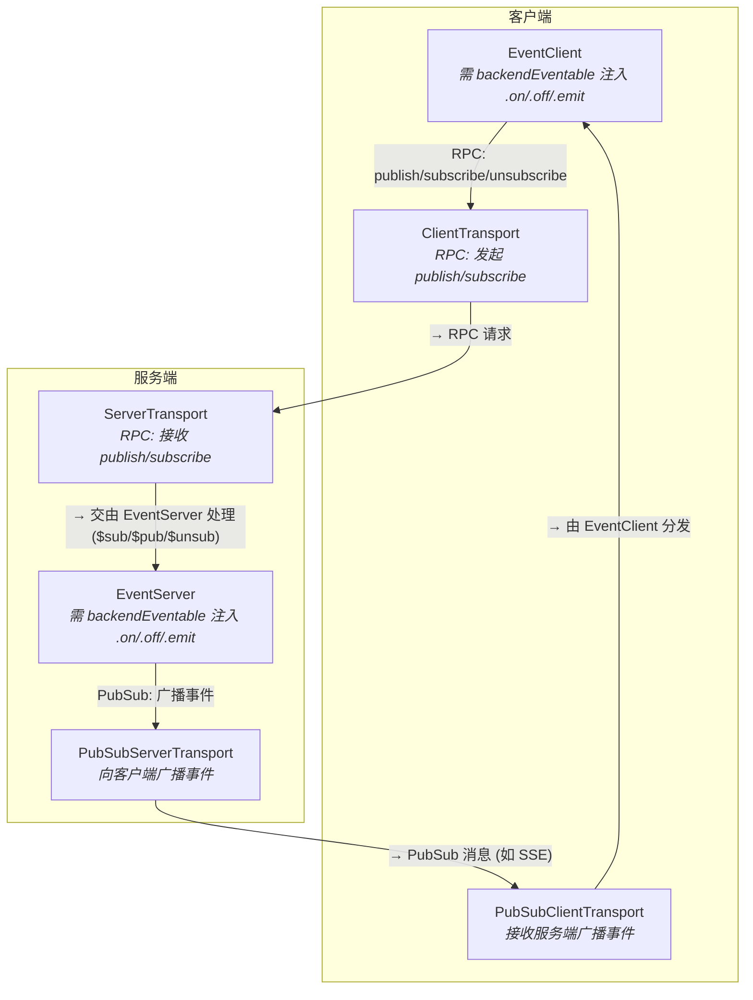

# @isdk/tool-event

`@isdk/tool-event` 为 `@isdk/tool-rpc` 生态系统带来了强大的实时、双向事件通信能力。

它的核心设计理念是**将发布/订阅模型无缝地集成到您已经熟悉的 RPC/RESTful 架构中**。您无需再手动管理独立的 WebSocket 或 SSE 连接，而是将实时事件视为另一种"工具"，它可以通过标准的 `tool-rpc` 框架被发现和调用。这种方法极大地简化了构建交互式 AI 代理、实时数据仪表盘、通知系统以及任何需要实时更新的应用的复杂性。

简而言之，`@isdk/tool-event` 让您用统一、简单的方式处理所有的事件，无论是远程服务上的事件，还是本地事件。

本项目基于 `@isdk/tool-func` 和 `@isdk/tool-rpc` 构建。在继续之前，请确保您已熟悉它们的核心概念。

## ✨ 核心功能

- **🚀 实时通信:** 提供了一个健壮的 Pub/Sub 模型，用于服务器和客户端之间的实时、双向事件流。
- **🔌 可插拔传输层:** 抽象的传输层允许使用不同的通信协议。内置了对 **服务器发送事件 (SSE)** 的实现。
- **🔗 无缝集成:** 扩展了 `@isdk/tool-rpc` 的 `ResServerTools` 和 `ResClientTools`，使事件端点的行为与其他 RESTful/RPC 工具一样。
- **🔄 自动转发:** 可轻松地将服务器端事件总线上的事件转发给客户端，或将本地客户端事件转发到服务器。
- **🎯 定向发布:** 从服务器向所有订阅的客户端发布事件，或通过客户端 ID 定向发布给特定客户端。
- **🔐 默认安全:** 服务器为每个连接的客户端生成唯一 UUID。客户端发布的事件是沙箱化的，不会自动注入到服务器的主事件总线中，除非显式启用 (`autoInjectToLocalBus`)，以防止意外的副作用。

## 🚀 快速上手

### 1. 安装

```bash
npm install @isdk/tool-event
```

### 2. 服务端设置 (`server.ts`)

库中已经导出了一个预先实例化的 `EventServer` 类实例，名为 `eventServer`。该实例的工具名称由导出的常量 `EventName` 定义（其值为 `'event'`）。

```typescript
import { EventServer, eventServer, SseServerPubSubTransport } from '@isdk/tool-event';
import { ServerTools, HttpServerToolTransport } from '@isdk/tool-rpc';

// 1. 设置服务端 SSE 传输层 (SSE 是内置的传输协议)
EventServer.setPubSubTransport(new SseServerPubSubTransport());

// 2. 注册预设的 EventServer 实例 (其实例名称 eventServer.name 默认为 'event')
eventServer.register();

// 3. 启动 HTTP 服务器，注册 RPC 处理和服务发现
const server = new HttpServerToolTransport();
server.addRpcHandler('/api');
server.addDiscoveryHandler('/api', () => ServerTools.toJSON());
await server.start({ port: 3000 });

console.log('事件服务端已启动：http://localhost:3000/api');

// 示例：使用静态方法向所有已订阅的客户端广播事件
setInterval(() => {
  EventServer.publish('server-time', { time: new Date().toISOString() });
}, 5000);
```

### 3. 客户端设置 (`client.ts`)

同样，客户端可以直接使用库中导出的 `EventClient` 类实例 `eventClient`。

```typescript
import { EventClient, eventClient, SseClientPubSubTransport, backendEventable } from '@isdk/tool-event';
import { ClientTools } from '@isdk/tool-rpc';

async function main() {
  const apiRoot = 'http://localhost:3000/api';

  // 1. 配置客户端 API URL 并加载远程工具定义
  ClientTools.apiUrl = apiRoot;
  await ClientTools.loadFrom();

  // 2. 设置客户端 SSE 传输层 (必须在设置 apiUrl 之后)
  EventClient.setPubSubTransport(new SseClientPubSubTransport());

  // 3. 让 EventClient 具备事件能力 (注入 .on(), .off(), .emit() 方法)
  backendEventable(EventClient);

  // 4. 注册 eventClient 实例
  eventClient.register();

  // 5. 订阅并监听 'server-time' 事件
  await eventClient.subscribe('server-time');

  eventClient.on('server-time', (name, data) => {
    console.log('收到服务器推送的时间:', data.time);
  });
  // > ⚠️ 注意：`(name, data)` 签名是因为上面第3步调用了 `backendEventable`。
  // > 没有它的话，`on()` 只会收到 `data`（不会自动添加名称）。

  // 6. (可选) 向服务器发布事件
  await eventClient.publish({ event: 'client-hello', data: { message: '你好，服务端！' } });
}

main().catch(console.error);
```

## 🏛️ 架构

`@isdk/tool-event` 系统构建在一个强大而灵活的架构之上，该架构将事件逻辑与底层通信协议分离开来。其核心是一个**可插拔的发布/订阅（PubSub）传输层**，允许您通过简单地提供一个兼容的传输实现，来使用服务器发送事件（SSE）、WebSockets、IPC 或任何其他协议。

要获取完整的开发者指南，请参阅 [**PubSub 开发者指南 (pubsub.md)**](./pubsub.md)。

### 统一事件总线

该系统创建了一个跨越服务器和客户端的无缝、双向事件总线。它通过分离**控制平面**（用于管理订阅）和**数据平面**（用于传递事件）来实现这一点。

- **🛠️ 控制平面 (RPC):** 像 `subscribe` 和 `unsubscribe` 这样的操作，通过主 `@isdk/tool-rpc` 传输作为标准的 RPC 调用来处理（映射为 `$sub` / `$unsub` 动作）。这复用了现有的、熟悉的服务发现和调用基础设施。
- **📡 数据平面 (PubSub):** 实际的事件负载通过一个专用的、抽象的、可插拔的 PubSub 传输（如 SSE）异步地传递给客户端。



### 核心概念：设计哲学

为了充分理解 `EventServer` 和 `EventClient`，关键是要明白它们的设计初衷：**将实时事件无缝地集成到 `@isdk/tool-rpc` 的现有 RPC/RESTful 架构中**。它们不仅仅是事件处理器，更是连接本地事件与远程世界的智能桥梁。

#### 1. 为什么要继承 `ResServerTools` / `ResClientTools`？

这个核心设计决策带来了几大好处，避免了重新发明轮子：

- **统一的服务发现与客户端代理**：因为 `EventServer` 是一个标准的 `ResServerTools`，所以 `HttpClientToolTransport` 可以自动发现它，并在客户端动态创建一个功能齐全的 `EventClient` 代理。您无需为事件处理编写任何特殊的客户端配置。

- **统一的 API 调用方式**：订阅、取消订阅和发布事件等操作被巧妙地映射为标准的 RPC 调用。
  - `eventClient.subscribe(...)` 在幕后变成了一个对服务器的 RPC 调用 (`act: '$sub'`)。
  - `eventClient.publish(...)` 同样是一个 RPC 调用 (`act: '$publish'`)。
  这意味着开发者可以使用与项目中其他工具完全相同的方式与事件系统交互，大大降低了学习成本。

- **复用传输层**：整个 `@isdk/tool-rpc` 的传输层和中间件生态系统都可以被直接复用。

#### 2. 事件流作为一种"资源"

该库优雅地将一个有状态的、持久的连接（如 SSE）抽象成一个无状态的、符合 REST 风格的"资源"。

- **获取事件流**：当客户端第一次需要订阅事件时，`EventClient` 会向 `GET /api/event` (这是 `EventServer` 的 `list` 方法) 发起请求。这个请求的响应就是一个 `text/event-stream` 类型的持久流。服务端会分配一个唯一的 UUID 作为 `clientId`，并通过 `welcome` 事件发送给客户端。从概念上讲，这等同于"获取"一个代表实时事件流的资源。

- **管理事件流**：后续的 `subscribe` 和 `publish` 操作可以被看作是对这个"资源"状态的修改，它们通过独立的、常规的 RPC 请求来完成。

这种设计将复杂的实时连接管理简化为开发者已经非常熟悉的、清晰的 REST/RPC 模型。

#### 3. 作为"桥梁"的角色

`EventServer` 和 `EventClient` 的核心功能是充当**桥梁**：

- **`EventServer`** 是 **服务器内部事件总线** 与 **网络客户端** 之间的桥梁。
  - **出站 (Outbound)**: 通过 `forward()` 方法监听内部事件（例如，数据库更新），并将它们发布到网络上，供所有订阅的客户端接收。
  - **入站 (Inbound)**: 接收从客户端发布来的事件，并通过 `autoInjectToLocalBus` 选项，有选择地将这些事件加上 `client:` 前缀后发送到内部事件总线上，供服务器的其他部分处理。

- **`EventClient`** 是 **网络** 与 **客户端应用本地事件总线** 之间的桥梁。
  - **入站 (Inbound)**: 监听从服务器通过网络推送过来的事件，并在自己的实例上（经 `backendEventable` 注入后）发出这些事件。这使得您的应用程序代码只需通过 `eventClient.on(...)` 即可轻松消费。
  - **出站 (Outbound)**: 通过 `publish()` 或 `forwardEvent()` 方法，将客户端本地的事件发布到网络上，发送给服务器。

## 🚀 高级用法

### 1. 在服务器上处理客户端发布的事件

默认情况下，为安全起见，从客户端发布的事件不会在服务器的事件总线上触发。要启用此行为，您需要设置 `EventServer.autoInjectToLocalBus = true`。然后，您可以监听带有 `client:` 前缀的事件。

**服务器端 (`server.ts`):**

```typescript
import { event } from '@isdk/tool-event'; // 导入底层的 event tool
const eventBus = event.runSync(); // 获取 event bus 实例

// ... 在服务器启动代码中 ...

// 启用自动注入
EventServer.autoInjectToLocalBus = true;

// 监听来自任何客户端的 'client-greeting' 事件
eventBus.on('client:client-greeting', function(data, ctx) {
  // 'this' 是事件对象，'ctx' 包含元信息（含发送者 session）
  const senderId = ctx.sender?.clientId;
  console.log(`[服务器] 收到来自客户端 ${senderId} 的问候:`, data);

  // 作为一个响应，只向发送者回送一个私人事件
  EventServer.publish('private-reply', { message: '我收到你的消息了！' }, {
    clientId: senderId,
  });
});
```

当快速入门中的客户端发送 `client-greeting` 事件时，服务器将打印日志并向该特定客户端发送一个私有回复。

**重要**：`ctx` 中的 `sender` 对象包含从传输层会话中提取的可信 `clientId`（而非客户端负载中的值），这是一个防止身份冒充的关键安全措施。

### 2. 向特定客户端发布 (定向发布)

您可以通过在 `publish` 方法中指定 `clientId` 来将事件发送给特定用户，而不是广播给所有订阅者。

**客户端 (`client.ts`):**

```typescript
// ... 在 main 函数中 ...

// 订阅一个私有事件
await eventClient.subscribe('private-reply');

// 监听该事件
eventClient.on('private-reply', (name, data) => {
  console.log(`[客户端] 收到私有回复:`, data);
});
```

此设置创建了一个请求-响应模式，其中客户端发起一个公共事件，服务器以一个只有该客户端能收到的私有事件作为回应。

### 3. 动态订阅

客户端不仅可以在初始连接时订阅事件，还可以在任何时候通过调用 `subscribe` 或 `unsubscribe` 来更改其订阅。这对于允许用户动态加入或离开"房间"或"频道"非常有用。

```typescript
// client.ts

// ... 假设 eventClient 已经初始化 ...

async function manageSubscriptions() {
  console.log('订阅 "news" 频道...');
  await eventClient.subscribe('news');

  // 模拟一段时间后不再对 "news" 感兴趣
  setTimeout(async () => {
    console.log('取消订阅 "news" 频道...');
    await eventClient.unsubscribe('news');
  }, 10000);
}
```

### 4. 客户端事件转发

`forwardEvent` 方法是将客户端本地事件活动无缝同步到服务器的强大工具。假设您的客户端应用有自己的内部事件总线，用于处理 UI 交互。您可以选择性地将某些事件转发到服务器进行处理或广播。

```typescript
// client.ts

// ... 假设 eventClient 已经初始化且已应用 backendEventable ...

// 1. 配置转发：任何本地发出的 'user-action' 事件都将发送到服务器
eventClient.forwardEvent('user-action');

console.log('[客户端] 设置 "user-action" 事件转发。');

// 2. 模拟一个本地UI事件
setTimeout(() => {
  const actionData = { action: 'button-click', elementId: 'save-button' };
  console.log('[客户端] 在本地总线上发出 "user-action":', actionData);
  eventClient.emit('user-action', actionData);
}, 2000);

// 在服务器端，您可以像处理任何其他客户端发布的事件一样处理 'client:user-action'

// 要停止转发，请使用 unforwardEvent:
// eventClient.unforwardEvent('user-action');
```

此模式对于将客户端行为（如分析、日志记录或状态更改）同步到后端非常有用，而无需在每个事件点手动编写 `publish` 调用。

### 5. 服务端事件总线转发

在服务器端，您可以使用 `forward()` 方法自动将全局事件总线上的事件中继到所有订阅的客户端。

```typescript
import { EventServer, eventServer, event } from '@isdk/tool-event';

const eventBus = event.runSync();

// 1. 配置服务器转发特定事件
eventServer.forward(['user-updated', 'item-added']);

// 2. 现在，服务器的任何其他部分只需在总线上触发事件，
//    它们就会自动广播给所有订阅的客户端。
function updateUser(user: any) {
  // 这将转发给所有订阅的客户端
  eventBus.emit('user-updated', { userId: user.id, status: 'active' });
}

// 停止转发：
// eventServer.unforward(['user-updated']);
```

### 6. 客户端连接生命周期管理

`EventClient` 提供了多种方法来管理 SSE/PubSub 连接的生命周期。

```typescript
// 初始化（重新连接）并订阅特定事件
await eventClient.init(['news', 'updates']);

// 检查连接是否活跃
if (eventClient.active) {
  console.log('连接活跃');
}

// 激活/停用连接
await eventClient.setActive(true);  // 连接
await eventClient.setActive(false); // 断开

// 关闭连接
eventClient.close();
```

### 7. 实现并使用可插拔传输层

本库的核心优势之一是其传输层是完全可插拔的。虽然内置了 SSE 实现，但您可以轻松创建并换成您自己的实现（例如，基于 WebSocket 或 IPC）。

您需要做的是实现 `IPubSubServerTransport` 接口。以下是一个基于 `ws` (一个流行的 WebSocket 库) 的概念性骨架示例：

```typescript
// transports/WebSocketServerTransport.ts
import { WebSocketServer } from 'ws';
import type { IPubSubServerTransport, PubSubServerSession } from '@isdk/tool-event';

export class WebSocketServerTransport implements IPubSubServerTransport {
  readonly name = 'websocket';
  readonly protocol = 'ws';
  private wss: WebSocketServer;
  private sessions = new Map<string, PubSubServerSession>();
  private onMsg: (session: PubSubServerSession, event: string, data: any) => void;
  private onConn?: (session: PubSubServerSession) => void;
  private onDis?: (session: PubSubServerSession) => void;

  constructor(options: { port: number }) {
    this.wss = new WebSocketServer({ port: options.port });

    this.wss.on('connection', (ws) => {
      const clientId = uuid(); // 生成唯一ID
      const session: PubSubServerSession = {
        id: clientId,
        clientId,
        protocol: 'ws',
        send: (event, data) => {
          ws.send(JSON.stringify({ event, data }));
        },
        close: () => ws.close(),
        raw: ws,
      };
      this.sessions.set(clientId, session);
      this.onConn?.(session);

      ws.on('message', (message) => {
        const { event, data } = JSON.parse(message.toString());
        this.onMsg?.(session, event, data);
      });

      ws.on('close', () => {
        this.sessions.delete(clientId);
        this.onDis?.(session);
      });
    });
  }

  connect(options?: { req?: any; res?: any; clientId?: string; events?: string[] }) {
    throw new Error('WebSocket 传输使用自己的连接生命周期。');
  }

  getSessionFromReq(req: any): PubSubServerSession | undefined {
    return this.sessions.get(req.headers['x-client-id']);
  }

  subscribe(session: PubSubServerSession, events: string[]) {
    // 为此会话跟踪订阅
  }

  unsubscribe(session: PubSubServerSession, events: string[]) {
    // 为此会话移除订阅
  }

  publish(event: string, data: any, target?: { clientId?: string | string[] }) {
    const payload = JSON.stringify({ event, data });
    if (target?.clientId) {
      const ids = Array.isArray(target.clientId) ? target.clientId : [target.clientId];
      ids.forEach(id => this.sessions.get(id)?.raw.send(payload));
    } else {
      this.wss.clients.forEach(client => client.send(payload));
    }
  }

  onMessage(cb: (session: PubSubServerSession, event: string, data: any) => void) {
    this.onMsg = cb;
  }

  onConnection(cb: (session: PubSubServerSession) => void) {
    this.onConn = cb;
  }

  onDisconnect(cb: (session: PubSubServerSession) => void) {
    this.onDis = cb;
  }
}
```

**如何使用它:**

您只需在服务器启动时将 `EventServer` 的传输替换为您自己的实现即可。

```typescript
// server.ts
// import { SseServerPubSubTransport } from '@isdk/tool-event'; // 旧的
import { WebSocketServerTransport } from './transports/WebSocketServerTransport'; // 新的

// const sseTransport = new SseServerPubSubTransport(); // 旧的
const wsTransport = new WebSocketServerTransport({ port: 8080 }); // 新的

// EventServer.setPubSubTransport(sseTransport); // 旧的
EventServer.setPubSubTransport(wsTransport); // 新的

// ... 剩余代码保持不变
```

通过这种方式，您的核心业务逻辑（`EventServer`）与底层通信协议完全解耦。

### 8. 使用 `backendEventable` 简化后端事件处理

为了实现一种更集成、面向对象的事件处理方法，`@isdk/tool-event` 提供了一个强大的 `backendEventable` 工具函数。它使用 `custom-ability` 库的 AOP（面向切面编程）模式，通过 `createAbilityInjector` 将事件能力（`on`、`emit`、`once`、`off` 等）直接注入到类的原型中。

这种模式特别适用于：

- 让 `EventServer` 自身能够触发其生命周期事件。
- 允许任何后端服务（只要它继承自 `ToolFunc`）轻松地发布或订阅事件，而无需直接引用事件总线。
- **增强 `EventClient`，使其成为一个功能强大的本地事件总线，同时连接到服务器和其他客户端。**

**如何使用 `backendEventable`：**

在您的应用程序的主设置文件中，您可以增强希望具备事件感知能力的类。这通常在应用程序启动时一次性完成。

```typescript
// --- 在您的应用程序主设置文件中 ---
import { EventServer, EventClient, backendEventable, EventBusName, event } from '@isdk/tool-event';
import { ToolFunc } from '@isdk/tool-func';

// 1. 增强 EventServer 类本身，使其具备事件感知能力。
// 这会"修补"该类，因此任何 EventServer 实例现在都可以使用 `this.emit()`。
backendEventable(EventServer);

// 2. 增强 EventClient 类，使其具备事件感知能力（使用默认事件总线名称）。
// 如果在同一进程中同时使用 EventServer 和 EventClient（如测试），
// 可以指定自定义事件总线名称以避免冲突：
// const EventBusClientName = 'event-bus-client';
// backendEventable(EventClient, { eventBusName: EventBusClientName });
backendEventable(EventClient);


// (可选) 增强一个自定义服务类
class MyCustomService extends ToolFunc {
  name = 'my-service';
  doSomething() {
    console.log('[MyService] 正在做某事并发出一个事件。');
    this.emit('my-service-event', { info: '发生了一些重要的事情' });
  }
}
backendEventable(MyCustomService);


// --- 稍后，在服务器初始化期间 (server.ts) ---

async function startServer() {
  // 设置共享事件总线（一次性设置）
  const eventBus = event.runSync();
  new ToolFunc(EventBusName, { tools: { emitter: eventBus } }).register();

  // 供 server 端使用（使用不同的名称以避免与预导出的 `eventServer` 单例冲突）
  const eventTool = new EventServer('my-event');
  eventTool.register();

  const myService = new MyCustomService();
  myService.register();

  // 现在，实例之间可以通过事件总线进行通信
  eventTool.on('my-service-event', (name, data) => {
    console.log('EventServer 实例捕获到来自 MyCustomService 的事件:', data);
  });

  // 触发发出事件的方法
  myService.doSomething();

  // 您仍然可以使用静态的 publish 方法，它使用同一个事件总线
  EventServer.publish('another-event', { from: '静态调用' });
}
```

`emit()` 方法会自动将工具的 `name` 作为第一个参数传递给监听器，便于识别事件来源。例如：

```typescript
eventTool.on('my-service-event', function(name, data) {
  // name 将为 'my-service'（来源工具的名称）
  // data 将为 { info: '发生了一些重要的事情' }
});
```

## 🤝 贡献

我们欢迎各种形式的贡献！请阅读 [CONTRIBUTING.md](./CONTRIBUTING.md) 文件以获取有关如何开始的指南。

## 📄 许可证

该项目根据 MIT 许可证授权。有关更多详细信息，请参阅 [LICENSE-MIT](./LICENSE-MIT) 文件。
