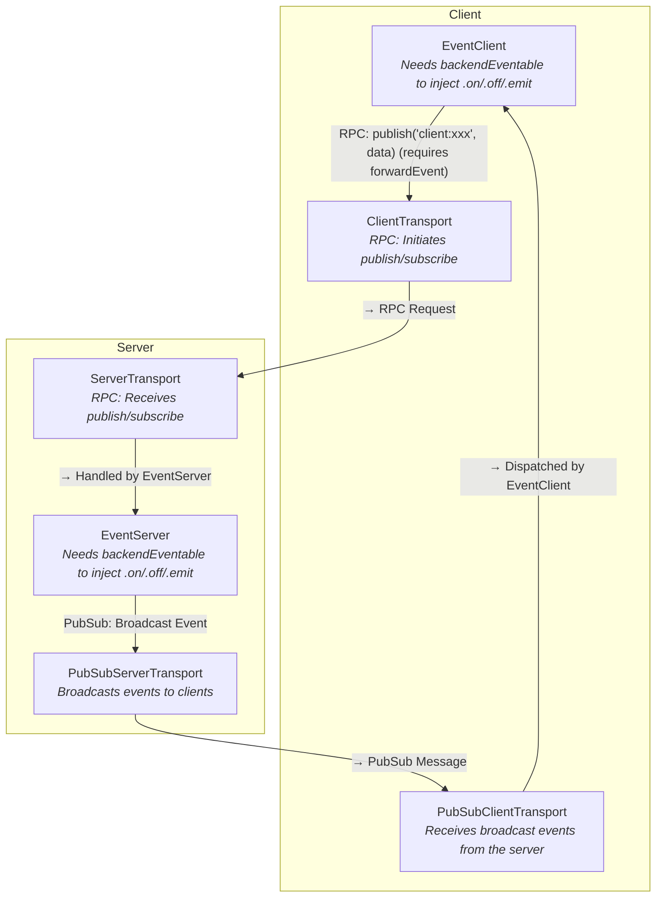

# @isdk/tool-event

`@isdk/tool-event` brings powerful, real-time, bidirectional event communication to the `@isdk/tool-rpc` ecosystem.

Its core design philosophy is to **seamlessly integrate a publish/subscribe model into the familiar RPC/RESTful architecture you already use**. Instead of manually managing a separate WebSocket or SSE connection, you treat real-time events as just another "tool" that is discoverable and callable through the standard `tool-rpc` framework. This approach dramatically simplifies the complexity of building interactive AI agents, live data dashboards, notification systems, and any application requiring real-time updates.

In short, `@isdk/tool-event` allows you to handle all events in a unified and simple way, whether they are events on remote services or local events.

This package is built upon `@isdk/tool-func` and `@isdk/tool-rpc`. Please ensure you are familiar with their core concepts before proceeding.

## ✨ Core Features

- **🚀 Real-Time Communication:** Provides a robust Pub/Sub model for real-time, bidirectional event flow between server and clients.
- **🔌 Pluggable Transport Layer:** Abstracted transport layer allows using different communication protocols. Comes with a built-in implementation for **Server-Sent Events (SSE)**.
- **🔗 Seamless Integration:** Extends `@isdk/tool-rpc`'s `ResServerTools` and `ResClientTools`, making event endpoints behave like any other RESTful/RPC tool.
- **🔄 Automatic Forwarding:** Easily forward events from a server-side event bus to clients, or from a client-side event bus to the server.
- **🎯 Targeted Publishing:** Publish events from the server to all subscribed clients or target specific clients by their ID.
- **🔐 Secure by Default:** Client-published events are sandboxed and are not automatically injected into the server's main event bus unless explicitly enabled, preventing unintended side effects.

## 🚀 Quick Start

### 1. Installation

```bash
npm install @isdk/tool-event
```

### 2. Server-Side Setup (`server.ts`)

The library exports a pre-instantiated instance of the `EventServer` class named `eventServer`. The tool name for this instance is defined by the exported constant `EventName` (whose value is `'event'`).

```typescript
import { EventServer, eventServer, SseServerPubSubTransport } from '@isdk/tool-event';
import { ServerTools, HttpServerToolTransport } from '@isdk/tool-rpc';

// 1. Set up the server-side SSE transport (SSE is a built-in protocol)
EventServer.setPubSubTransport(new SseServerPubSubTransport());

// 2. Register the pre-instantiated EventServer instance (default name is 'event')
eventServer.register();

// 3. Start the HTTP server and mount tools at the /api path
const server = new HttpServerToolTransport();
server.mount(ServerTools, '/api');
server.start({ port: 3000 });

console.log('Event server started at: http://localhost:3000/api');

// Example: Broadcast an event to all subscribed clients using the static method
setInterval(() => {
  EventServer.publish('server-time', { time: new Date().toISOString() });
}, 5000);
```

### 3. Client-Side Setup (`client.ts`)

Similarly, on the client side, you can directly use the exported `eventClient` instance of the `EventClient` class.

```typescript
import { EventClient, eventClient, SseClientPubSubTransport } from '@isdk/tool-event';
import { ClientTools, HttpClientToolTransport } from '@isdk/tool-rpc';

async function main() {
  const apiRoot = 'http://localhost:3000/api';

  // 1. Set up the client-side SSE transport
  EventClient.setPubSubTransport(new SseClientPubSubTransport());

  // 2. Initialize the client transport and connect to the remote server
  const clientTransport = new HttpClientToolTransport(apiRoot);
  await clientTransport.mount(ClientTools);

  // 3. Subscribe to and listen for the 'server-time' event (using the exported eventClient)
  await eventClient.subscribe('server-time');
  
  eventClient.on('server-time', (data) => {
    console.log('Received server time:', data.time);
  });

  // 4. (Optional) Publish an event to the server
  await eventClient.publish({ event: 'client-hello', data: { message: 'Hello from client!' } });
}

main().catch(console.error);
```

## 🏛️ Architecture

The `@isdk/tool-event` system is built on a powerful and flexible architecture that separates event logic from the underlying communication protocol. Its core is a **pluggable PubSub transport layer**, allowing you to use Server-Sent Events (SSE), WebSockets, IPC, or any other protocol by simply providing a compatible transport.

For a complete developer's guide, please see the [**PubSub Developer's Guide (pubsub.md)**](./pubsub.md).

### The Unified Event Bus

The system creates a seamless, bidirectional event bus that spans the server and client. It achieves this by separating the **control plane** (for managing subscriptions) from the **data plane** (for delivering events).

- **🛠️ Control Plane (RPC):** Actions like `subscribe` and `unsubscribe` are handled as standard RPC calls through the main `@isdk/tool-rpc` transport. This reuses the existing, familiar infrastructure for discovery and invocation.
- **📡 Data Plane (PubSub):** Actual event payloads are delivered asynchronously to clients via a dedicated, abstract, and pluggable PubSub transport.

This design is illustrated below:



### Core Concepts: The Design Philosophy

To fully grasp `EventServer` and `EventClient`, it's crucial to understand their design goal: **to seamlessly integrate real-time events into the existing RPC/RESTful architecture of `@isdk/tool-rpc`**. They are more than just event handlers; they are intelligent bridges connecting local events to the remote world.

#### 1. Why Inherit from `ResServerTools` / `ResClientTools`?

This core design decision provides several major benefits by extending a familiar framework rather than reinventing the wheel:

- **Unified Discovery and Client Proxying**: Because `EventServer` is a standard `ResServerTools`, the `HttpClientToolTransport` can automatically discover it and dynamically create a full-featured `EventClient` proxy on the client-side. You don't need to write any special client configuration for event handling.

- **Unified API Invocation**: Actions like subscribing, unsubscribing, and publishing are cleverly mapped to standard RPC calls.
  - `eventClient.subscribe(...)` becomes an RPC call (`act: '$sub'`) to the server behind the scenes.
  - `eventClient.publish(...)` is likewise an RPC call (`act: '$publish'`).
  This means developers can interact with the event system in the exact same way they interact with other tools in the project, dramatically reducing the learning curve.

- **Transport Reuse**: The entire transport and middleware ecosystem of `@isdk/tool-rpc` is reused out-of-the-box.

#### 2. The Event Stream as a "Resource"

The library elegantly abstracts a stateful, persistent connection (like SSE) into a stateless, REST-style "resource."

- **Getting the Event Stream**: When a client needs to subscribe to an event for the first time, the `EventClient` makes a request to `GET /api/event` (which is the `list` method of the `EventServer`). The response to this request is a persistent stream of type `text/event-stream`. Conceptually, this is equivalent to "getting" a resource that represents the real-time event flow.

- **Managing the Event Stream**: Subsequent actions like `subscribe` and `publish` can be seen as modifications to the state of this "resource," and they are handled through separate, conventional RPC requests.

This design simplifies the complexity of real-time connection management into a clean REST/RPC model that developers are already very familiar with.

#### 3. The Role as a "Bridge"

The core function of `EventServer` and `EventClient` is to act as a **bridge**:

- **`EventServer`** is the bridge between the **internal server-side event bus** and **networked clients**.
  - **Outbound**: Through the `forward()` method, it listens to internal events (e.g., a database update) and "publishes" them over the network for all subscribed clients to receive.
  - **Inbound**: It receives events "published" from clients and, via the `autoInjectToLocalBus` option, selectively "emits" them (prefixed with `client:`) onto the internal event bus for other parts of the server to process.

- **`EventClient`** is the bridge between the **network** and the **client application's local event bus**.
  - **Inbound**: It listens for events pushed from the server over the network and "emits" them on its own instance (which is itself an `EventEmitter`). This allows your application code to consume them easily with `eventClient.on(...)`.
  - **Outbound**: Through the `publish()` or `forwardEvent()` methods, it "publishes" local client-side events over the network to the server.

In summary, this design allows developers to ignore the complex details of network protocols and connection management most of the time. You simply listen for or emit events on the appropriate event bus, and `@isdk/tool-event` handles all the tedious work in between.

## 🚀 Advanced Usage

### 1. Handling Client-Published Events on the Server

By default, for security, events published from a client do not trigger on the server's event bus. To enable this, set `EventServer.autoInjectToLocalBus = true`. You can then listen for events prefixed with `client:`.

**Server-Side (`server.ts`):**

```typescript
import { event } from '@isdk/tool-event'; // Import the underlying event tool
const eventBus = event.runSync(); // Get the event bus instance

// ... in your server startup code ...

// Enable auto-injection
EventServer.autoInjectToLocalBus = true;

// Listen for the 'client-greeting' event from any client
eventBus.on('client:client-greeting', function(data, ctx) {
  // 'this' is the event object, 'ctx' contains metadata
  const senderId = ctx.sender?.clientId;
  console.log(`[Server] Received greeting from client ${senderId}:`, data);

  // As a response, echo back a private event only to the sender
  EventServer.publish('private-reply', { message: 'I got your message!' }, {
    clientId: senderId,
  });
});
```

When the client from the Quick Start sends its `client-greeting` event, the server will now log it and send a private reply back to that specific client.

### 2. Publishing to a Specific Client (Targeted Publishing)

Instead of broadcasting to all subscribers, you can send an event to a specific user by providing their `clientId` in the `publish` method.

**Client-Side (`client.ts`):**

```typescript
// ... in your main function ...

// Subscribe to a private event
eventClient.subscribe('private-reply');

// Listen for it
eventClient.on('private-reply', (data) => {
  console.log(`[Client] Received a private reply:`, data);
});
```

This setup creates a request-response pattern where a client initiates a public event, and the server responds with a private event that only the originating client receives.

### 3. Dynamic Subscriptions

A client can change its subscriptions at any time, not just on initial connection, by calling `subscribe` or `unsubscribe`. This is useful for scenarios like allowing users to dynamically join or leave "rooms" or "channels".

```typescript
// client.ts

// ... assuming eventClient is already initialized ...

async function manageSubscriptions() {
  console.log('Subscribing to the "news" channel...');
  await eventClient.subscribe('news');

  // Simulate losing interest in "news" after a while
  setTimeout(async () => {
    console.log('Unsubscribing from the "news" channel...');
    await eventClient.unsubscribe('news');
  }, 10000);
}
```

### 4. Client-Side Event Forwarding

The `forwardEvent` method is a powerful way to seamlessly sync local client-side activity to the server. Imagine your client application has its own internal event bus for UI interactions. You can selectively forward certain events to the server for processing or broadcasting.

```typescript
// client.ts

// ... assuming eventClient is initialized and is eventable ...

// Let's say 'ui-event-bus' is a local EventEmitter used in your app.
// For demonstration, we'll have the eventClient play this role.
const localEventBus = eventClient;

// 1. Configure forwarding: any 'user-action' emitted on localEventBus will be sent to the server.
eventClient.forwardEvent('user-action');

console.log('[Client] Set up forwarding for "user-action" events.');

// 2. Simulate a local UI event
setTimeout(() => {
  const actionData = { action: 'button-click', elementId: 'save-button' };
  console.log('[Client] Emitting "user-action" on local bus:', actionData);
  localEventBus.emit('user-action', actionData);
}, 2000);

// On the server, you can now handle 'client:user-action' just like any other client-published event.
```

This pattern is excellent for syncing client behaviors (like analytics, logging, or state changes) to a backend without needing to write manual `publish` calls at every event site.

### 5. Implementing and Using Pluggable Transports

One of the library's core strengths is its pluggable transport layer. While it ships with an SSE implementation, you can easily create and swap in your own (e.g., based on WebSockets or IPC).

To do this, you need to implement the `IPubSubServerTransport` interface. Here is a conceptual skeleton example for a transport based on `ws`, a popular WebSocket library:

```typescript
// transports/WebSocketServerTransport.ts
import { WebSocketServer } from 'ws';
import type { IPubSubServerTransport, PubSubServerSession } from '@isdk/tool-event';

export class WebSocketServerTransport implements IPubSubServerTransport {
  readonly name = 'websocket';
  readonly protocol = 'ws';
  private wss: WebSocketServer;
  private sessions = new Map<string, PubSubServerSession>();
  private onMsg: (session: PubSubServerSession, event: string, data: any) => void;

  constructor(options: { port: number }) {
    this.wss = new WebSocketServer({ port: options.port });

    this.wss.on('connection', (ws) => {
      const clientId = uuid(); // Generate a unique ID
      const session: PubSubServerSession = {
        id: clientId,
        clientId,
        protocol: 'ws',
        send: (event, data) => {
          ws.send(JSON.stringify({ event, data }));
        },
        close: () => ws.close(),
        raw: ws,
      };
      this.sessions.set(clientId, session);

      ws.on('message', (message) => {
        const { event, data } = JSON.parse(message.toString());
        // Invoke the callback registered by EventServer to handle inbound messages
        this.onMsg?.(session, event, data);
      });

      ws.on('close', () => {
        this.sessions.delete(clientId);
      });
    });
  }

  // EventServer will call this to register its message handler
  onMessage(cb) {
    this.onMsg = cb;
  }

  publish(event: string, data: any, target?: { clientId: string | string[] }) {
    const payload = JSON.stringify({ event, data });
    if (target?.clientId) {
      const ids = Array.isArray(target.clientId) ? target.clientId : [target.clientId];
      ids.forEach(id => this.sessions.get(id)?.raw.send(payload));
    } else {
      this.wss.clients.forEach(client => client.send(payload));
    }
  }

  // Note: For WebSockets, connect/subscribe/unsubscribe are often handled
  // within the connection and message events, so these might be no-ops or for logging.
  connect(options) { /* ... */ }
  subscribe(session, events) { /* ... */ }
  unsubscribe(session, events) { /* ... */ }
  onConnection(cb) { /* ... */ }
  onDisconnect(cb) { /* ... */ }
}
```

**How to use it:**

You would simply replace the transport on your `EventServer` during startup.

```typescript
// server.ts
// import { SseServerPubSubTransport } from '@isdk/tool-event'; // Old
import { WebSocketServerTransport } from './transports/WebSocketServerTransport'; // New

// ...

// const sseTransport = new SseServerPubSubTransport(); // Old
const wsTransport = new WebSocketServerTransport({ port: 8080 }); // New

// EventServer.setPubSubTransport(sseTransport); // Old
EventServer.setPubSubTransport(wsTransport); // New

// ... the rest of your code remains the same
```

This way, your core business logic in `EventServer` remains completely decoupled from the underlying communication protocol.

### 6. Simplifying Backend Event Handling with `backendEventable`

For a more integrated, object-oriented approach to events, `@isdk/tool-event` provides a powerful `backendEventable` utility. Instead of calling the static `EventServer.publish()` method from anywhere, you can make your classes first-class event citizens.

The `backendEventable` function is a decorator that injects event capabilities (`on`, `emit`, `once`, etc.) directly into a class's prototype. This allows instances of that class to interact with the shared event bus using a familiar `this.emit()` and `this.on()` syntax.

This is particularly useful for:

- Making `EventServer` itself capable of emitting its own lifecycle events.
- Allowing any backend service (that extends `ToolFunc`) to easily publish or subscribe to events without needing a direct reference to the event bus.
- **Enhancing `EventClient` to act as a powerful local event bus that is also connected to the server and other clients.**

**How to use `backendEventable`:**

In your application's main setup file, you can enhance the classes you want to make event-aware. This is typically done once when your application starts.

```typescript
// --- In your application's main setup file (e.g., server.ts or client.ts) ---
import { EventServer, EventClient, backendEventable, EventBusName } from '@isdk/tool-event';
import { ToolFunc, ClientTools } from '@isdk/tool-func';
import { event } from 'events-ex';

// 1. Enhance the EventServer class itself to be event-aware.
// This "patches" the class, so any instance of EventServer can now use `this.emit()`.
backendEventable(EventServer);

// 2. Enhance the EventClient class to be event-aware.
// This makes EventClient instances a powerful local event bus connected to the server.
const EventBusClientName = 'event-bus-client'; // As seen in test/event-server.test.ts
backendEventable(EventClient, { eventBusName: EventBusClientName });


// (Optional) Enhance a custom service class
class MyCustomService extends ToolFunc {
  name = 'my-service';
  doSomething() {
    console.log('[MyService] Doing something and emitting an event.');
    this.emit('my-service-event', { info: 'Something important happened' });
  }
}
backendEventable(MyCustomService);


// --- Later, during server initialization (server.ts) ---

async function startServer() {
  // Set up the shared event bus (one-time setup).
  const eventBus = event.runSync();
  new ToolFunc(EventBusName, { tools: { emitter: eventBus } }).register();

  // Instantiate your enhanced classes.
  const eventTool = new EventServer('event');
  eventTool.register();

  const myService = new MyCustomService();
  myService.register();

  // Now, instances can communicate via the event bus.
  // Listen for the custom service event on the EventServer instance.
  eventTool.on('my-service-event', (data) => {
    console.log('EventServer instance caught event from MyCustomService:', data);
    // You could then forward this to clients if needed:
    // eventTool.publish('event-for-client', data);
  });

  // Trigger the method that emits the event.
  myService.doSomething();

  // You can also still use the static publish method, which uses the same bus.
  EventServer.publish('another-event', { from: 'static call' });
}

// startServer(); // Commented out for client-side example clarity


// --- Later, during client initialization (client.ts) ---

async function startClient() {
  // Set up the client-side event bus (one-time setup).
  const clientEventBus = event.runSync();
  new ToolFunc(EventBusClientName, { tools: { emitter: clientEventBus } }).register();

  // Register EventClient with ClientTools (as seen in test/event-server.test.ts)
  const event4Client = new EventClient('event');
  ClientTools.register(event4Client);

  // Now, the EventClient instance can use `this.emit()` and `this.on()`
  // to interact with its local event bus, which is also connected to the server.
  event4Client.on('server-time', (data) => {
    console.log('[Client] Received server-time via EventClient instance:', data);
  });

  // Example: Emit a local client event that can be forwarded to the server
  event4Client.emit('local-client-event', { action: 'user-clicked' });
}

// startClient(); // Commented out for server-side example clarity
```

This pattern promotes a cleaner, more decoupled architecture where different parts of your system can communicate through events without being tightly bound to each other.

## 🤝 Contributing

Contributions are welcome! Please read the [CONTRIBUTING.md](./CONTRIBUTING.md) file for guidelines on how to get started.

## 📄 License

This project is licensed under the MIT License. See the [LICENSE-MIT](./LICENSE-MIT) file for more details.
